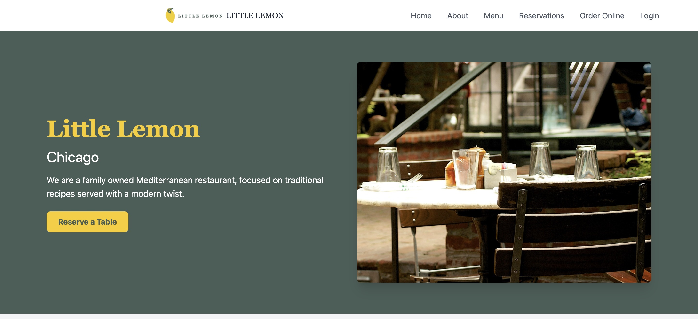
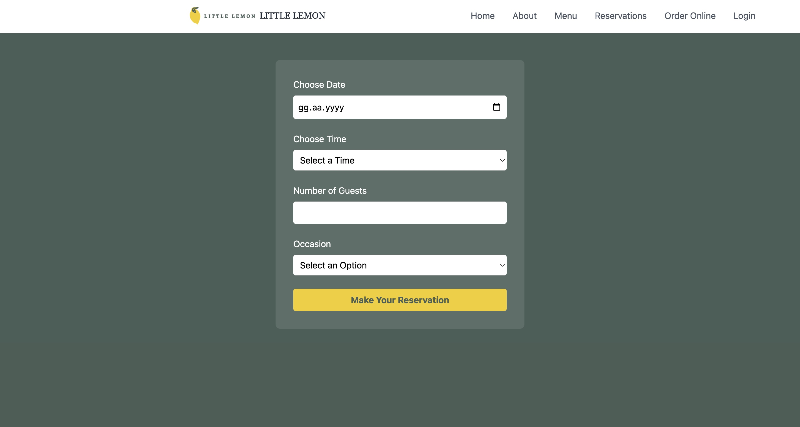

# Little Lemon Restaurant Website

## Project Description
Little Lemon is a family-owned Mediterranean restaurant located in Chicago. This website project provides an online presence for the restaurant, allowing customers to learn about our offerings, view our menu, and make reservations online.

## Features
- **Online Reservation System**: Easy-to-use booking system for table reservations
- **Menu Display**: Complete menu with descriptions and prices
- **Responsive Design**: Fully responsive website that works on all devices
- **User Authentication**: Secure login system for managing reservations

## Screenshots

### Homepage

*Homepage featuring our restaurant's ambiance and main navigation*

### Reservation System

*Our intuitive reservation form allowing customers to book tables easily*

## Technologies Used
- React.js
- React Router for navigation
- Tailwind CSS for styling
- Modern JavaScript (ES6+)

## Getting Started

### Prerequisites
- Node.js (v14 or higher)
- npm or yarn package manager

### Installation
1. Clone the repository
```bash
git clone https://github.com/yourusername/little-lemon.git
